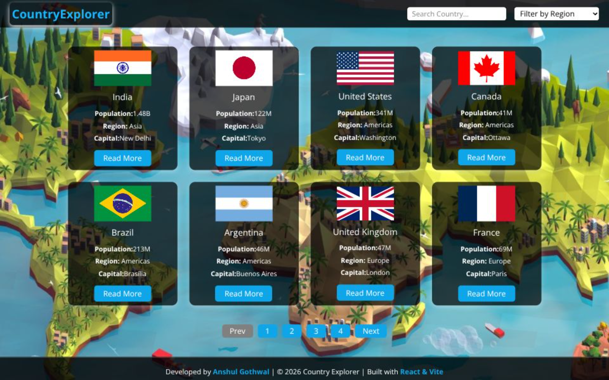

# 🌎Country Explorer

A modern and responsive Country Explorer built using **React.js & Vite**. It allows users to explore Countries details with an attractive Cards UI, search functionality, sorting, and pagenation options.

## 🚀 Live Demo

👉 https://country-explorer-zeta-five.vercel.app

## 📸 Screenshots

## ✨ Features

* 🎥 Browse Country Explorer.
* 🔍 Search by Name.
* 🎭 Filter by Region
* 🎨 Dark-themed modern UI
* 📱 Fully responsive design
* 💳 Clean and interactive movie cards

## 🛠️ Tech Stack

* HTML5
* CSS3
* JavaScript (ES6)
* React.js & Vite
* JSON (Local Database)

## 👨‍💻 Author

**Anshul Gothwal**

GitHub: https://github.com/AnshulGothwal
